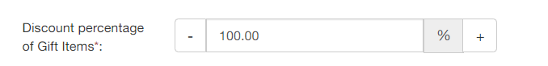

# Features in Setting page

### 1. Using DraftOder API

Basically, our Free Gifts works by cloning a variant from the original product to be the gift then send it to your customer. When this feature is enabled, the app will use Shopify’s Draft-order API instead of cloning variant. After that, the app will be able to work properly with Oberlo or other Inventory Management apps. 

However, this feature’s limit is that only 2 orders are supported per second \(Please contact us at support@secomapp.com if you need more\) 

### 2. Synchronize products

All cloned variants won’t be tracked inventory. You can enable this feature to track the inventory of the gifts items by 3 options: 

* **Do not track inventory**: Decrease the inventory of original products once customer receives gifts
* **Stop the offer and Notify customers when the gift is out of stock**: This option will synchronize the inventory of gift variant with original products then Stop the offer & Notify customers when the gift is out of stock
* **Store owner will manually input clone gift variant inventory**: After creating an offer, please go to each cloned gift items on Products page to input inventory for them

### 3. Gift item’s price condition & Gift’s price discount based

#### 3.1. Gift item’s price should be less or equal to the product’s price customer added 

When this feature is enabled, only gift item, which has a lower price than the products in cart, will be automatically added to the customers’ cart. 

#### 3.2. Use current price of the selected product as the gift for checking above condition \(default using compart\_at\_price value\) 

By default, our app use the above feature \(3.1\) by comparing the compare\_at\_price value of the product. By enabling this feature, it will compare the original price of the product instead. 

#### 3.3. Calculate gift’s price base on the current price of the original product \(default base on compare\_at\_price value\) 

Normally, we calculate the discount percentage of gift item base on the compare\_at\_price value. By enabling this feature, the discount percentage of gift items will be calculated based on the original price.

### 4. How the price of Gift item is calculated

If the gift of your offer is not free, the price of cloned item is calculated based on the discount value \(which you insert in the Discount percentage of Gift Items\) and the compare\_at\_price of original product. After this feature enabled, the price of the cloned items is calculated base on the price of original products. 

### 5. Free Gift icon

This feature will show a Free Gift icon on the right corner of the products that customers need to buy to receive gifts. By default, this feature is turned on and the Free Gift icons appear on collection pages.  

### 6. Show Gift items by Product only

By default, the gifts will appear as variants. For example, when you select a shirt with the variants as sizes to be the gift. All the variants will appear as size S, size M, etc for the customer to choose from. 

After enabling this feature, the gifts will appear as products only, which means a shirt with variants size will appear as only a shirt, with a box for the customer to choose his/her size. 

### 7. Manual select products and Ignore selected products

These two features will show more advanced features while creating offers

#### 7.1. Manual select products:

This feature enables you to select the products the customer should buy to get gifts \(Offer on Catalog\) by SKU/Title \(product’s name\)/ Variant’s name. Or even select by inputting product/variant’s ID manually. 
After enabling this feature, a new box inside Offer on Catalog will appear: 

#### 7.2. Ignore selected products

After enabling this feature, you will select the products that customer buy but not get the gifts instead of the products customers buy to get gift. 

For example, when you have a large number of products that customers buy will get gift. Instead of selecting large number of products, you can turn this feature on to select only the products that do not include the gifts. Then all the other products will be the products customers buy to get gifts. 

### 8. Product page, Free Gift popup, and Promotional message

These are the information of the gift products
  
By default, all of them are turned on. You can turn it off based on your need. 

### 9. Auto add gifts to cart

Normally, our app will automatically add gifts to customers’ cart if they meet all the conditions of the offer. However, you can turn it off in the Settings 

### 10. One time pick

This feature will limit customer to choose 1 variant for only 1 time. If they meet the conditions of other offers that have the same gifts, they cannot select it anymore. 11. Exclude added product

### 11. Exclude added product

This feature will hide the gift product if customer has the same product with it in their cart. 

### 12. Stop lower priority rule effective

Normally, the “stop lower priority rule” inside offer is effective only inside Offer on Cart or Offer on Catalog. When you turn on this feature in the Settings, all priority will be processed regardless of the type of offer as Offer on Cart or Offer on Catalog. 

### 13. Gift variant’s SKU/Barcode format

Normally, the gift variants cloned by our app will have the same SKU/Barcode as the original products’. If you are using inventory management system or 3rd party fulfillment, those apps won’t allow you to have the variants with exactly the same SKU/Barcode. In this case, we have to change the way to name those variants as “is blank” or “with suffix: \[original's SKU/Barcode\]\_\(xx%off\)” 

### 14. Remove duplicated variants

By enabling this feature, you can delete all cloned variants by deactivating the offers. This feature also ensures that the customer with depth knowledge about Shopify API won’t be able to purchase your variants for $0. 

### 15.  Customize the content of the text

You can change the content of those texts to be suitable for your customer. 

### 16. Advanced options

In this section, you can customize Free Gift image, Gift thumbnail size, and Gift list Slider setting. 

You can upload your own image to be the gift icon, change the Gift thumbnail size, and customize the Gift list Slide. You can refer more from OWL-Carousel [here
](http://www.landmarkmlp.com/js-plugin/owl.carousel/)

