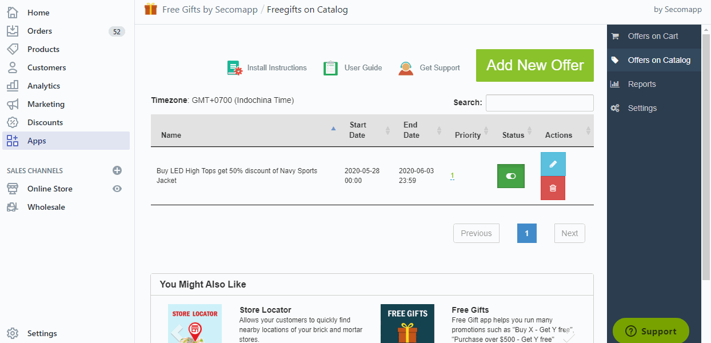

# How to use Gifts on Cart offer

 _If you want to reward gifts when customer purchases a order that meets your conditions. You need to create Gifts on Cart rule. Example:_

* _Buy &gt;200 USD and &lt;=300 USD to get a pen_
* _Buy&gt;300 USD and &lt;=400 USD to get a headphone_
* _Buy &gt;400 USD to get a mobile phone_

For start to create new Cart offer rule, please follow those steps:

**In the General section**, you will need to enter **Name**, **Start date and End Date**, **Promotion message**, and **URL of promotion banner**, **Maximum number of gifts,  Discount percentage of Gift Items, Priority** and **Stop lower priority rule**.  
**The promotion message and promotion banner** allow shop owner to advertise and  make customer to buy more. For example, buy &gt;200 to get a pen, then Enter a message:” Please buy over 200 USD to get a free gift”. Then if customer buys smaller than 200 USD, then he goes to cart page, the message will be shown so customer can see and decide to buy more to reach the condition.  
**Maximum number of gifts**: The total number of free gifts that customers are allowed to select. For example,you select 5 gifts in the Select Gifts section and you insert the value “2”, customers may only select maximum 2 of the 5 gifts.  
**Discount percentage of Gift Items**: This field allows owner to set discount of gifts items. The default is 100%, It means the gift is free. However sometimes customer can create a promotion: Buy more than 1000 USD get 50% discount for the Iphone.  
**Priority** and **Stop lower priority rule** allows to run multi Gifts on cart rules.  In the case shop owner creates multiple rules: The rules are processed by priority. If you select to set “Stop lower priority rule” to Yes, the next rules \(with lower priorities\) will not be processed. In case that all the rules do not stop further rules processing, then all the rules will be processed.

  
  
**In the condition section**: Enter the condition of the gifts on cart rule. If customer satifies this condition, he will get gifts.

  
**In the Select Gifts section**: Please click the button select gifts, a popup will be open and you can select products that you will reward customers. You also select a or many collection as gifts \(Example: customer can select 1 gift in all products of collection Smart Phone\)

