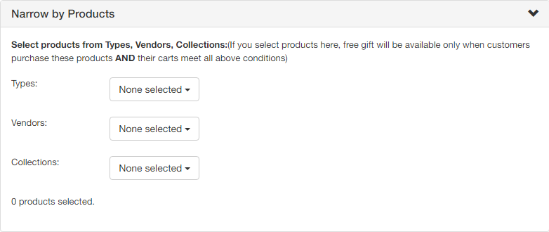

# How to create Offer on Cart

Offer on Cart means to reward your customer when their orders meet specific conditions.   
For example: 

* Purchase over $200 get a pen 

## **Here are the step-by-step instructions to create a new Offer on Cart:**

### General section

1. **Name**: Set the Name of your offer 
2. **Description**: Set the Description of your offer
3. **Start Date and End Date**: Set the duration of your offer \(date, hour\) 
4. **Promotion message**: Set the message to appear on the customers’ cart page. 

   For example: Customers will see your “Purchase over $500 to get a free gift” message so they are motivated to reach that condition to get a free gift. 

5. **Maximum number of gifts**: Set the number of gifts that customers are allowed to select when you offer them choices among several gifts. 

   Note: When you set this field to 0, all your free gifts will be automatically added to your customers’ cart 

6. **Discount percentage of Gift Items**: Set the discount percentage of your gift items. By default, the percentage is 100%, which means a free gift. 
7. **Priority**: Set the priority in case you run multiple offers. The smaller number means the greater priority.
8. **Stop lower priority rule**: The offers are processed by priority so if you enable this feature, lower priority won’t be processed. 

### **Condition section: Set the condition of your offer** 

You can set up the condition of your offer based on 2 criteria: Total Cart’s value and Total Cart’s quantity. 
You can also narrow your offer by Products or Customers’ order history

Narrow by Products means: Customers have to buy these products and meet the offer’s condition to receive the gifts.

Narrow by Customers’ order history: Only customers who meet the condition of their orders history, such as total spent, total number of orders, total spent on last order, customers’ tags, and condition of this offer will have gifts

### **Select Gifts section**

After clicking on the “Select Gifts” button, a list of your products will appear for you to choose from. 
  
****You can select collection\(s\) as gifts for customers to choose their gifts from. 

Finally, click on “Save Changes” and “Apply Now” to apply the changes to your store immediately. 

