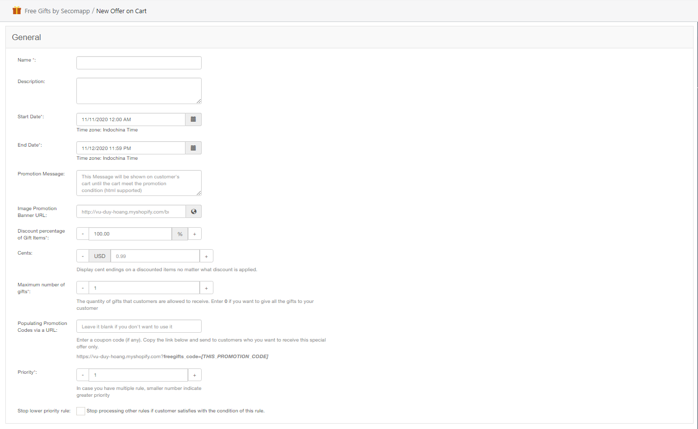

# How to create Offer on Catalog

Offer on Catalog rewards gifts to customers when they purchase specific product\(s\).   
For example: 

* Buy an iPhone get a free phone case

## **Here are the step-by-step instructions to create a new Offer on Cart:** 

### **General Section** 

1. Name: Set the Name of your offer 
2. Description: Set the Description of your offer
3. Start Date and End Date: Set the duration of your offer \(date, hour\) 
4. Promotion message: Set the message to appear on the customers’ cart page. 

   For example: Customers will see your “Purchase over $500 to get a free gift” message so they are motivated to reach that condition to get a free gift. 

5. Maximum number of gifts: Set the number of gifts that customers are allowed to select when you offer them choices among several gifts. 

   Note: When you set this field to 0, all your free gifts will be automatically added to your customers’ cart 

6. Discount percentage of Gift Items: Set the discount percentage of your gift items. By default, the percentage is 100%, which means a free gift. 
7. Priority: Set the priority in case you run multiple offers. The smaller number means the greater priority.
8. Stop lower priority rule: The offers are processed by priority so if you enable this feature, lower priority won’t be processed. 

### **Select Products Section** 

This section allows you to select the products that customers need to buy to get gifts
  
You can select specific products or collection, vendor, or types \(If you select a collection, it means that purchases any product from that collection will get gift\) 

### **Select Gifts Section**

Click on the “Select Gifts” button, then a pop up will appear for you to choose products as gifts for your customer.   
After that, click on the “Create” button then “Apply Now” to make immediate changes to your live store.   

