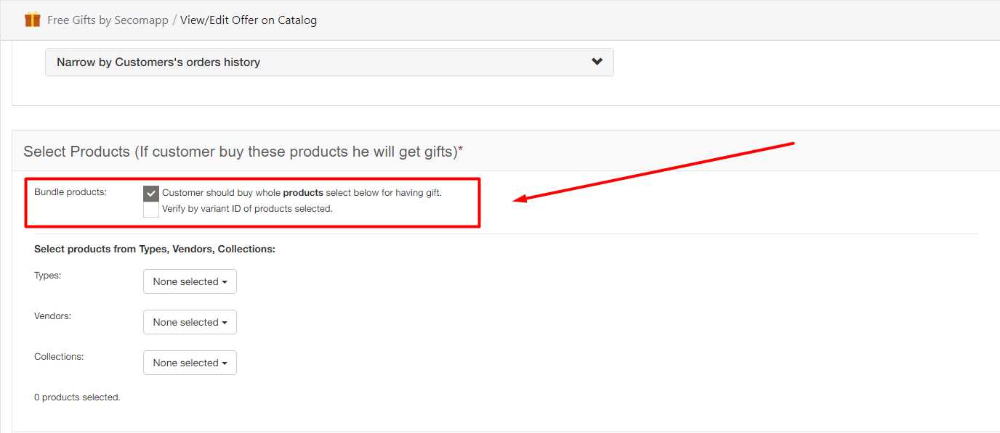

# The "Bundle products" feature

When the “Bundle products” feature is enabled, your customers have to buy a specific list of products to have gifts. You are able to verify this list by variant ID or product ID \(default\). 

